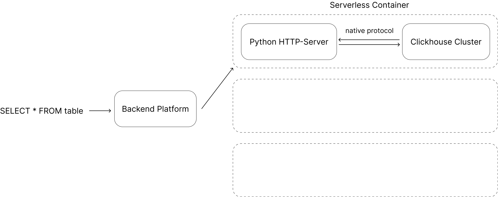

# ClickHouse Native Runner

Минимальный HTTP-прокси для ClickHouse, который работает в serverless контейнерах (Yandex Cloud Serverless Container, AWS Fargate, Google Cloud Run и т.д.).



## Описание

ClickHouse Native Runner предоставляет легковесный HTTP API для выполнения SQL-запросов к ClickHouse через нативный протокол. Проект оптимизирован для работы в serverless окружениях с минимальным временем старта и размером образа.

## Требования

- Docker (для сборки образа)
- Python 3.11+ (встроен в образ)
- ClickHouse Server (встроен в образ или внешний)

## Установка

### Сборка Docker образа

```bash
docker build -t clickhouse-native-runner:latest .
```

### Запуск контейнера

```bash
docker run -d --name ch-native \
  -p 8080:8080 \
  -e PORT=8080 \
  clickhouse-native-runner:latest
```

## Архитектура

```
HTTP-запрос → Serverless Container (PORT) 
           → Python HTTP-сервер (server.py)
           → clickhouse-driver (localhost:9000)
           → ClickHouse (нативный протокол)
```

## Особенности

- ✅ Минимальный размер образа (только Python runtime)
- ✅ Быстрый старт (встроенный http.server)
- ✅ Учетные данные приходят в каждом запросе
- ✅ Поддержка нативного протокола ClickHouse (порт 9000)
- ✅ CORS поддержка
- ✅ **Сессии**: поддержка `session_id` для выполнения цепочек запросов в одном соединении (временные таблицы, контекст)

## API Endpoints

### Health Check
```bash
GET /health
GET /
```

### Выполнение SQL-запроса

#### Через GET с заголовками
```bash
curl -X GET "http://your-container-url/query?q=SELECT+1" \
  -H "X-ClickHouse-User: quantilecamp" \
  -H "X-ClickHouse-Key: admin123"
```

#### Через GET с query параметрами
```bash
curl -X GET "http://your-container-url/query?q=SELECT+1&user=quantilecamp&password=admin123"
```

#### Через POST с JSON
```bash
curl -X POST "http://your-container-url/query" \
  -H "Content-Type: application/json" \
  -H "X-ClickHouse-User: quantilecamp" \
  -H "X-ClickHouse-Key: admin123" \
  -d '{"query": "SELECT 1"}'
```

#### С трейс-логами (trace=true)
```bash
curl -X GET "http://your-container-url/query?q=SELECT+1&trace=true" \
  -H "X-ClickHouse-User: quantilecamp" \
  -H "X-ClickHouse-Key: admin123"
```

Или через POST:
```bash
curl -X POST "http://your-container-url/query" \
  -H "Content-Type: application/json" \
  -H "X-ClickHouse-User: quantilecamp" \
  -H "X-ClickHouse-Key: admin123" \
  -d '{"query": "SELECT 1", "trace": true}'
```

Или через заголовок:
```bash
curl -X GET "http://your-container-url/query?q=SELECT+1" \
  -H "X-ClickHouse-User: quantilecamp" \
  -H "X-ClickHouse-Key: admin123" \
  -H "X-ClickHouse-Trace: true"
```

#### Сессия (session_id) для временных таблиц

Чтобы выполнить несколько запросов в одном контексте (например, `CREATE TEMPORARY TABLE ...` → `SELECT ...`), передайте `session_id`.

Через query params:
```bash
curl -X GET "http://your-container-url/query?q=CREATE+TEMPORARY+TABLE+temp+AS+SELECT+1&session_id=my-session"
curl -X GET "http://your-container-url/query?q=SELECT+*+FROM+temp&session_id=my-session"
```

Или через заголовок:
```bash
curl -X GET "http://your-container-url/query?q=SELECT+*+FROM+temp" \
  -H "X-ClickHouse-User: quantilecamp" \
  -H "X-ClickHouse-Key: admin123" \
  -H "X-ClickHouse-Session-Id: my-session"
```

`session_timeout` (сек) можно передать query param / JSON body, по умолчанию 120.

#### Через POST с учетными данными в JSON
```bash
curl -X POST "http://your-container-url/query" \
  -H "Content-Type: application/json" \
  -d '{
    "query": "SELECT 1",
    "user": "quantilecamp",
    "password": "admin123",
    "database": "default"
  }'
```

#### Через Basic Auth
```bash
curl -X GET "http://your-container-url/query?q=SELECT+1" \
  -H "Authorization: Basic $(echo -n 'quantilecamp:admin123' | base64)"
```

## Формат ответа

### Стандартный ответ (без trace)

```json
{
  "data": [[val1, val2], ...],
  "meta": [
    {"name": "col1", "type": "String"},
    {"name": "col2", "type": "Int32"}
  ],
  "rows": 10,
  "rows_before_limit_at_least": 10,
  "statistics": {
    "elapsed_ns": 123456789,
    "elapsed_ms": 123.456789,
    "read_rows": 1000,
    "read_bytes": 50000,
    "written_rows": 0,
    "written_bytes": 0,
    "result_rows": 10,
    "result_bytes": 250
  }
}
```

### Ответ с трейс-логами (trace=true)

```json
{
  "data": [[val1, val2], ...],
  "meta": [...],
  "rows": 10,
  "rows_before_limit_at_least": 10,
  "statistics": {...},
  "trace": [
    "2025-12-11 20:00:00 DEBUG clickhouse_driver: Query started",
    "2025-12-11 20:00:00 TRACE clickhouse_driver: Reading data...",
    ...
  ]
}
```

При ошибке:
```json
{
  "data": [],
  "meta": [],
  "rows": 0,
  "rows_before_limit_at_least": 0,
  "statistics": {},
  "error": "Error message"
}
```

## Переменные окружения

- `PORT` - порт для HTTP-сервера (устанавливается Serverless Container)
- `CLICKHOUSE_HOST` - хост ClickHouse (по умолчанию `localhost`)
- `CLICKHOUSE_PORT` - порт ClickHouse (по умолчанию `9000`)
- `CLICKHOUSE_DATABASE` - база данных по умолчанию (по умолчанию `default`)

## Сборка образа

```bash
docker build -t clickhouse-native-runner:latest .
```

## Локальное тестирование

```bash
docker run -d --name ch-native \
  -p 8080:8080 \
  -e PORT=8080 \
  clickhouse-native-runner:latest

# Тест
curl -X GET "http://localhost:8080/query?q=SELECT+1" \
  -H "X-ClickHouse-User: admin" \
  -H "X-ClickHouse-Key: admin123"
```

## Приоритет получения учетных данных

1. HTTP заголовки: `X-ClickHouse-User`, `X-ClickHouse-Key`
2. Authorization заголовок: `Basic base64(user:password)`
3. Query параметры: `user`, `password`, `database`
4. JSON тело запроса: `user`, `password`, `database`

## Разработка

### Локальная разработка

1. Клонируйте репозиторий:
```bash
git clone <repository-url>
cd clickhouse_native_runner
```

2. Установите зависимости:
```bash
pip install -r requirements.txt
```

3. Запустите сервер локально (требуется запущенный ClickHouse):
```bash
export PORT=8080
export CLICKHOUSE_HOST=localhost
export CLICKHOUSE_PORT=9000
python3 server.py
```

### Структура проекта

```
clickhouse_native_runner/
├── server.py              # Основной HTTP-сервер
├── Dockerfile             # Docker образ
├── start.sh               # Скрипт запуска контейнера
├── requirements.txt       # Python зависимости
├── clickhouse/
│   ├── config/            # Конфигурация ClickHouse
│   └── storage/           # Данные ClickHouse (исключены из git)
└── schema/                # SQL схемы и миграции
```

## Лицензия

Этот проект распространяется под лицензией MIT. См. файл [LICENSE](LICENSE) для подробностей.

