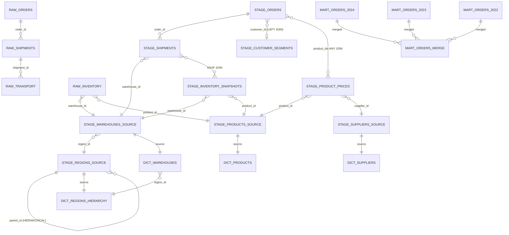

# Схема данных Logistics & Supply Chain

## Общее описание

База данных `logistics` предназначена для демонстрации различных возможностей ClickHouse в контексте логистики и управления цепями поставок. Схема организована в три слоя:

- **RAW LAYER** - сырые данные с JSON и Array колонками
- **STAGE LAYER** - очищенные данные с различными движками MergeTree
- **MART LAYER** - аналитические витрины с агрегацией

---

## RAW LAYER - Сырые данные

### Таблица: `logistics.raw_orders`

**Назначение:** Хранение сырых данных о заказах с JSON и Array колонками для демонстрации работы с полуструктурированными данными.

**Связи:**
- Связана с `raw_shipments` через `order_id` (один заказ может иметь несколько поставок)
- Связана с `stage_orders` (очищенная версия)

**DDL:**
```sql
CREATE OR REPLACE TABLE logistics.raw_orders
(
    order_id String COMMENT 'Уникальный идентификатор заказа',
    customer_id String COMMENT 'Идентификатор клиента',
    order_date Date COMMENT 'Дата заказа',
    order_datetime DateTime COMMENT 'Дата и время создания заказа',
    total_amount Decimal(10, 2) COMMENT 'Общая сумма заказа',
    metadata_json String COMMENT 'JSON с метаданными заказа (payment_method, discount, special_instructions)',
    items_json String COMMENT 'JSON массив товаров в заказе',
    tags Array(String) COMMENT 'Массив тегов заказа: urgent, vip, express и т.д.',
    product_ids Array(String) COMMENT 'Массив идентификаторов товаров в заказе',
    quantities Array(UInt32) COMMENT 'Массив количеств товаров (соответствует product_ids)',
    prices Array(Decimal(10, 2)) COMMENT 'Массив цен товаров (соответствует product_ids)',
    discount_percentages Array(UInt8) COMMENT 'Массив процентов скидок по товарам',
    delivery_dates Array(Date) COMMENT 'Массив дат доставки (если несколько этапов)',
    status_history Array(String) COMMENT 'История статусов заказа: created, paid, shipped, delivered',
    status_timestamps Array(DateTime) COMMENT 'Временные метки изменения статусов (соответствует status_history)',
    created_at DateTime DEFAULT now() COMMENT 'Время создания записи',
    source String DEFAULT 'api' COMMENT 'Источник данных: api, kafka, airflow etl'
)
ENGINE = MergeTree()
PARTITION BY toYYYYMM(order_date)
ORDER BY (order_date, order_id);
```

**Примеры данных:**
```sql
-- Пример 1: Заказ с несколькими товарами
order_id: 'ORD000001'
customer_id: 'CUST00001'
order_date: '2024-01-15'
order_datetime: '2024-01-15 10:30:00'
total_amount: 12500.50
metadata_json: '{"payment_method": "card", "discount_percent": 10, "special_instructions": "Хрупкий груз"}'
items_json: '[{"product_id": "PROD001", "quantity": 2, "price": 5000.00}, {"product_id": "PROD002", "quantity": 1, "price": 2500.50}]'
tags: ['urgent', 'vip']
product_ids: ['PROD001', 'PROD002']
quantities: [2, 1]
prices: [5000.00, 2500.50]
discount_percentages: [10, 5]
delivery_dates: ['2024-01-20']
status_history: ['created', 'paid', 'shipped']
status_timestamps: ['2024-01-15 10:30:00', '2024-01-15 11:00:00', '2024-01-16 09:00:00']
created_at: '2024-01-15 10:30:00'
source: 'api'

-- Пример 2: Простой заказ
order_id: 'ORD000002'
customer_id: 'CUST00042'
order_date: '2024-02-20'
order_datetime: '2024-02-20 14:15:00'
total_amount: 3500.00
metadata_json: '{"payment_method": "cash", "discount_percent": 0}'
items_json: '[{"product_id": "PROD015", "quantity": 3, "price": 1166.67}]'
tags: ['standard']
product_ids: ['PROD015']
quantities: [3]
prices: [1166.67]
discount_percentages: [0]
delivery_dates: ['2024-02-25']
status_history: ['created', 'paid']
status_timestamps: ['2024-02-20 14:15:00', '2024-02-20 14:20:00']
created_at: '2024-02-20 14:15:00'
source: 'api'
```

---

### Таблица: `logistics.raw_shipments`

**Назначение:** Хранение сырых данных о поставках с информацией о маршрутах, упаковках и трекинге.

**Связи:**
- Связана с `raw_orders` через `order_id` (многие поставки к одному заказу)
- Связана с `raw_transport` через `shipment_id` (одна поставка может иметь несколько транспортировок)
- Связана с `stage_warehouses_source` через `warehouse_id` (многие поставки к одному складу)

**DDL:**
```sql
CREATE OR REPLACE TABLE logistics.raw_shipments
(
    shipment_id String COMMENT 'Уникальный идентификатор поставки',
    order_id String COMMENT 'Идентификатор заказа (связь с raw_orders)',
    warehouse_id String COMMENT 'Идентификатор склада отправления',
    shipment_date Date COMMENT 'Дата поставки',
    shipment_datetime DateTime COMMENT 'Дата и время отправки',
    route_json String COMMENT 'JSON с данными маршрута доставки (waypoints, distance, duration)',
    tracking_json String COMMENT 'JSON с трекинг информацией (events, locations, timestamps)',
    package_ids Array(String) COMMENT 'Массив идентификаторов упаковок в поставке',
    package_weights Array(Float32) COMMENT 'Массив весов упаковок (соответствует package_ids)',
    tracking_numbers Array(String) COMMENT 'Массив трекинг номеров для отслеживания',
    checkpoints Array(String) COMMENT 'Массив точек контроля: warehouse, transit, delivery, customs',
    checkpoint_times Array(DateTime) COMMENT 'Временные метки прохождения точек контроля (соответствует checkpoints)',
    vehicle_ids Array(String) COMMENT 'Массив идентификаторов транспортных средств (если перегрузка)',
    driver_ids Array(String) COMMENT 'Массив идентификаторов водителей (если смена водителя)',
    created_at DateTime DEFAULT now() COMMENT 'Время создания записи',
    source String DEFAULT 'api' COMMENT 'Источник данных'
)
ENGINE = MergeTree()
PARTITION BY toYYYYMM(shipment_date)
ORDER BY (shipment_date, shipment_id);
```

**Примеры данных:**
```sql
-- Пример 1: Поставка с несколькими упаковками
shipment_id: 'SHIP000001'
order_id: 'ORD000001'
warehouse_id: 'WH001'
shipment_date: '2024-01-16'
shipment_datetime: '2024-01-16 09:00:00'
route_json: '{"waypoints": ["Москва", "Санкт-Петербург", "Новгород"], "distance_km": 850, "estimated_duration_hours": 12}'
tracking_json: '{"events": [{"timestamp": "2024-01-16 09:00:00", "location": "Москва", "status": "warehouse"}, {"timestamp": "2024-01-16 15:30:00", "location": "Санкт-Петербург", "status": "transit"}]}'
package_ids: ['PKG000001-1', 'PKG000001-2']
package_weights: [15.5, 12.3]
tracking_numbers: ['TRK123456', 'TRK123457']
checkpoints: ['warehouse', 'transit', 'delivery']
checkpoint_times: ['2024-01-16 09:00:00', '2024-01-16 15:30:00', '2024-01-17 10:00:00']
vehicle_ids: ['VEH250']
driver_ids: ['DRV150']
created_at: '2024-01-16 09:00:00'
source: 'api'

-- Пример 2: Простая поставка
shipment_id: 'SHIP000002'
order_id: 'ORD000002'
warehouse_id: 'WH002'
shipment_date: '2024-02-21'
shipment_datetime: '2024-02-21 08:00:00'
route_json: '{"waypoints": ["Екатеринбург", "Казань"], "distance_km": 450, "estimated_duration_hours": 6}'
tracking_json: '{"events": [{"timestamp": "2024-02-21 08:00:00", "location": "Екатеринбург", "status": "warehouse"}]}'
package_ids: ['PKG000002-1']
package_weights: [5.2]
tracking_numbers: ['TRK234567']
checkpoints: ['warehouse', 'delivery']
checkpoint_times: ['2024-02-21 08:00:00', '2024-02-21 14:00:00']
vehicle_ids: []
driver_ids: []
created_at: '2024-02-21 08:00:00'
source: 'api'
```

---

### Таблица: `logistics.raw_inventory`

**Назначение:** Хранение снимков состояния инвентаря на складах с информацией о партиях, локациях и поставщиках.

**Связи:**
- Связана с `stage_warehouses_source` через `warehouse_id` (многие снимки к одному складу)
- Связана с `stage_products_source` через `product_id` (многие снимки к одному товару)
- Связана с `stage_suppliers_source` через `supplier_ids` (массив) (многие снимки к одному поставщику)

**DDL:**
```sql
CREATE OR REPLACE TABLE logistics.raw_inventory
(
    inventory_id String COMMENT 'Уникальный идентификатор записи инвентаря',
    warehouse_id String COMMENT 'Идентификатор склада',
    product_id String COMMENT 'Идентификатор товара',
    snapshot_time DateTime COMMENT 'Время снимка состояния инвентаря',
    quantity UInt32 COMMENT 'Количество товара на складе',
    metadata_json String COMMENT 'JSON с дополнительными метаданными (batch_info, quality_control)',
    location_codes Array(String) COMMENT 'Массив кодов локаций на складе: A-1-2, B-3-4 (если товар в нескольких местах)',
    batch_numbers Array(String) COMMENT 'Массив номеров партий товара',
    expiry_dates Array(Date) COMMENT 'Массив сроков годности по партиям (соответствует batch_numbers)',
    supplier_ids Array(String) COMMENT 'Массив идентификаторов поставщиков (если товар из разных партий)',
    cost_prices Array(Decimal(10, 2)) COMMENT 'Массив себестоимостей по партиям (соответствует batch_numbers)',
    created_at DateTime DEFAULT now() COMMENT 'Время создания записи',
    source String DEFAULT 'api' COMMENT 'Источник данных'
)
ENGINE = MergeTree()
PARTITION BY toYYYYMM(snapshot_time)
ORDER BY (warehouse_id, product_id, snapshot_time);
```

**Примеры данных:**
```sql
-- Пример 1: Товар в нескольких локациях с разными партиями
inventory_id: 'INV00000001'
warehouse_id: 'WH001'
product_id: 'PROD001'
snapshot_time: '2024-01-15 10:00:00'
quantity: 150
metadata_json: '{"batch_info": "BATCH-1234", "quality_control": "passed"}'
location_codes: ['A-1-2', 'A-1-3', 'B-2-5']
batch_numbers: ['BATCH-1234', 'BATCH-1235']
expiry_dates: ['2024-12-31', '2025-01-15']
supplier_ids: ['SUP001', 'SUP002']
cost_prices: [450.00, 460.00]
created_at: '2024-01-15 10:00:00'
source: 'api'

-- Пример 2: Простой снимок инвентаря
inventory_id: 'INV00000002'
warehouse_id: 'WH002'
product_id: 'PROD015'
snapshot_time: '2024-02-20 14:00:00'
quantity: 75
metadata_json: '{"batch_info": "BATCH-5678", "quality_control": "pending"}'
location_codes: ['C-3-1']
batch_numbers: ['BATCH-5678']
expiry_dates: ['2024-06-30']
supplier_ids: ['SUP005']
cost_prices: [200.00]
created_at: '2024-02-20 14:00:00'
source: 'api'
```

---

### Таблица: `logistics.raw_transport`

**Назначение:** Хранение данных о транспортировках с детальной информацией о маршрутах и транспортных средствах.

**Связи:**
- Связана с `raw_shipments` через `shipment_id` (одна поставка может иметь несколько транспортировок)

**DDL:**
```sql
CREATE OR REPLACE TABLE logistics.raw_transport
(
    transport_id String COMMENT 'Уникальный идентификатор транспортировки',
    shipment_id String COMMENT 'Идентификатор поставки (связь с raw_shipments)',
    departure_time DateTime COMMENT 'Время отправления',
    arrival_time DateTime COMMENT 'Время прибытия',
    route_json String COMMENT 'JSON с детальной информацией о маршруте (coordinates, stops, traffic)',
    vehicle_info_json String COMMENT 'JSON с информацией о транспортном средстве (type, capacity, driver)',
    created_at DateTime DEFAULT now() COMMENT 'Время создания записи',
    source String DEFAULT 'api' COMMENT 'Источник данных'
)
ENGINE = MergeTree()
PARTITION BY toYYYYMM(departure_time)
ORDER BY (shipment_id, departure_time);
```

**Примеры данных:**
```sql
-- Пример 1: Транспортировка с детальным маршрутом
transport_id: 'TRANS000001'
shipment_id: 'SHIP000001'
departure_time: '2024-01-16 09:00:00'
arrival_time: '2024-01-17 10:00:00'
route_json: '{"coordinates": [{"lat": 55.7558, "lon": 37.6173}, {"lat": 59.9343, "lon": 30.3351}], "stops": ["Тверь", "Великий Новгород"], "traffic_delay_minutes": 15}'
vehicle_info_json: '{"type": "truck", "capacity_kg": 10000, "driver": {"name": "Иван Петров", "license": "DL123456"}}'
created_at: '2024-01-16 09:00:00'
source: 'api'

-- Пример 2: Короткая транспортировка
transport_id: 'TRANS000002'
shipment_id: 'SHIP000002'
departure_time: '2024-02-21 08:00:00'
arrival_time: '2024-02-21 14:00:00'
route_json: '{"coordinates": [{"lat": 56.8431, "lon": 60.6454}, {"lat": 55.8304, "lon": 49.0661}], "stops": [], "traffic_delay_minutes": 5}'
vehicle_info_json: '{"type": "van", "capacity_kg": 2000, "driver": {"name": "Петр Сидоров", "license": "DL234567"}}'
created_at: '2024-02-21 08:00:00'
source: 'api'
```

---

## STAGE LAYER - Очищенные данные

### Таблица: `logistics.stage_orders`

**Назначение:** Очищенные данные заказов с использованием ReplacingMergeTree для дедупликации. Данные извлечены из JSON и валидированы.

**Связи:**
- Связана с `raw_orders` (источник данных)
- Связана с `stage_customer_segments` через `customer_id` (LEFT JOIN - не все клиенты имеют сегмент)
- Связана с `stage_product_prices` через `product_ids` (ANY JOIN - дубликаты ключей)

**DDL:**
```sql
CREATE OR REPLACE TABLE logistics.stage_orders
(
    order_id String COMMENT 'Уникальный идентификатор заказа',
    customer_id String COMMENT 'Идентификатор клиента',
    order_date Date COMMENT 'Дата заказа',
    order_datetime DateTime COMMENT 'Дата и время создания заказа',
    total_amount Decimal(10, 2) COMMENT 'Общая сумма заказа',
    payment_method String COMMENT 'Способ оплаты: card, cash, transfer',
    status String COMMENT 'Текущий статус заказа: created, paid, shipped, delivered, cancelled',
    tags Array(String) COMMENT 'Массив тегов заказа (валидированные значения)',
    product_ids Array(String) COMMENT 'Массив идентификаторов товаров',
    quantities Array(UInt32) COMMENT 'Массив количеств товаров',
    prices Array(Decimal(10, 2)) COMMENT 'Массив цен товаров',
    status_history Array(String) COMMENT 'История статусов заказа',
    status_timestamps Array(DateTime) COMMENT 'Временные метки статусов',
    updated_at DateTime DEFAULT now() COMMENT 'Время последнего обновления',
    version UInt64 DEFAULT 1 COMMENT 'Версия записи для ReplacingMergeTree'
)
ENGINE = ReplacingMergeTree(version)
PARTITION BY toYYYYMM(order_date)
ORDER BY (order_id);
```

**Примеры данных:**
```sql
-- Пример 1: Заказ с полной историей
order_id: 'ORD000001'
customer_id: 'CUST00001'
order_date: '2024-01-15'
order_datetime: '2024-01-15 10:30:00'
total_amount: 12500.50
payment_method: 'card'
status: 'delivered'
tags: ['urgent', 'vip']
product_ids: ['PROD001', 'PROD002']
quantities: [2, 1]
prices: [5000.00, 2500.50]
status_history: ['created', 'paid', 'shipped', 'delivered']
status_timestamps: ['2024-01-15 10:30:00', '2024-01-15 11:00:00', '2024-01-16 09:00:00', '2024-01-17 10:00:00']
updated_at: '2024-01-17 10:00:00'
version: 1

-- Пример 2: Новый заказ
order_id: 'ORD000002'
customer_id: 'CUST00042'
order_date: '2024-02-20'
order_datetime: '2024-02-20 14:15:00'
total_amount: 3500.00
payment_method: 'cash'
status: 'paid'
tags: ['standard']
product_ids: ['PROD015']
quantities: [3]
prices: [1166.67]
status_history: ['created', 'paid']
status_timestamps: ['2024-02-20 14:15:00', '2024-02-20 14:20:00']
updated_at: '2024-02-20 14:20:00'
version: 1
```

---

### Таблица: `logistics.stage_shipments`

**Назначение:** Очищенные данные поставок с использованием CollapsingMergeTree для работы с изменяемыми данными.

**Связи:**
- Связана с `raw_shipments` (источник данных)
- Связана с `stage_orders` через `order_id` (многие поставки к одному заказу)
- Связана с `stage_warehouses_source` через `warehouse_id` (многие поставки к одному складу)
- Связана с `stage_inventory_snapshots` через `warehouse_id` и `snapshot_time` (ASOF JOIN)

**DDL:**
```sql
CREATE OR REPLACE TABLE logistics.stage_shipments
(
    shipment_id String COMMENT 'Уникальный идентификатор поставки',
    order_id String COMMENT 'Идентификатор заказа',
    warehouse_id String COMMENT 'Идентификатор склада',
    shipment_datetime DateTime COMMENT 'Дата и время отправки',
    status String COMMENT 'Статус поставки: pending, in_transit, delivered, returned',
    weight Decimal(10, 2) COMMENT 'Общий вес поставки в кг',
    package_ids Array(String) COMMENT 'Массив идентификаторов упаковок',
    package_weights Array(Float32) COMMENT 'Массив весов упаковок',
    tracking_numbers Array(String) COMMENT 'Массив трекинг номеров',
    checkpoints Array(String) COMMENT 'Массив точек контроля',
    checkpoint_times Array(DateTime) COMMENT 'Временные метки точек контроля',
    sign Int8 COMMENT 'Знак для CollapsingMergeTree: 1 - вставка, -1 - удаление',
    updated_at DateTime DEFAULT now() COMMENT 'Время последнего обновления'
)
ENGINE = CollapsingMergeTree(sign)
PARTITION BY toYYYYMM(shipment_datetime)
ORDER BY (shipment_id);
```

**Примеры данных:**
```sql
-- Пример 1: Активная поставка
shipment_id: 'SHIP000001'
order_id: 'ORD000001'
warehouse_id: 'WH001'
shipment_datetime: '2024-01-16 09:00:00'
status: 'delivered'
weight: 27.80
package_ids: ['PKG000001-1', 'PKG000001-2']
package_weights: [15.5, 12.3]
tracking_numbers: ['TRK123456', 'TRK123457']
checkpoints: ['warehouse', 'transit', 'delivery']
checkpoint_times: ['2024-01-16 09:00:00', '2024-01-16 15:30:00', '2024-01-17 10:00:00']
sign: 1
updated_at: '2024-01-17 10:00:00'

-- Пример 2: Поставка в пути
shipment_id: 'SHIP000002'
order_id: 'ORD000002'
warehouse_id: 'WH002'
shipment_datetime: '2024-02-21 08:00:00'
status: 'in_transit'
weight: 5.20
package_ids: ['PKG000002-1']
package_weights: [5.2]
tracking_numbers: ['TRK234567']
checkpoints: ['warehouse', 'transit']
checkpoint_times: ['2024-02-21 08:00:00', '2024-02-21 12:00:00']
sign: 1
updated_at: '2024-02-21 12:00:00'
```

---

### Таблица: `logistics.stage_inventory_snapshots`

**Назначение:** Снимки инвентаря для выполнения ASOF JOIN. Позволяет найти состояние инвентаря на момент времени.

**Связи:**
- Связана с `raw_inventory` (источник данных)
- Связана с `stage_warehouses_source` через `warehouse_id` (многие снимки к одному складу)
- Связана с `stage_products_source` через `product_id` (многие снимки к одному товару)
- Используется для ASOF JOIN с `stage_shipments` по `warehouse_id` и времени

**DDL:**
```sql
CREATE OR REPLACE TABLE logistics.stage_inventory_snapshots
(
    warehouse_id String COMMENT 'Идентификатор склада',
    product_id String COMMENT 'Идентификатор товара',
    snapshot_time DateTime COMMENT 'Время снимка (для ASOF JOIN)',
    quantity UInt32 COMMENT 'Количество товара на момент снимка',
    reserved_quantity UInt32 COMMENT 'Зарезервированное количество',
    available_quantity UInt32 COMMENT 'Доступное количество (quantity - reserved_quantity)',
    created_at DateTime DEFAULT now() COMMENT 'Время создания записи'
)
ENGINE = MergeTree()
PARTITION BY toYYYYMM(snapshot_time)
ORDER BY (warehouse_id, product_id, snapshot_time);
```

**Примеры данных:**
```sql
-- Пример 1: Снимок с резервированием
warehouse_id: 'WH001'
product_id: 'PROD001'
snapshot_time: '2024-01-15 10:00:00'
quantity: 150
reserved_quantity: 30
available_quantity: 120
created_at: '2024-01-15 10:00:00'

-- Пример 2: Снимок без резервирования
warehouse_id: 'WH002'
product_id: 'PROD015'
snapshot_time: '2024-02-20 14:00:00'
quantity: 75
reserved_quantity: 0
available_quantity: 75
created_at: '2024-02-20 14:00:00'

-- Пример 3: Последующий снимок того же товара
warehouse_id: 'WH001'
product_id: 'PROD001'
snapshot_time: '2024-01-15 15:00:00'
quantity: 120
reserved_quantity: 20
available_quantity: 100
created_at: '2024-01-15 15:00:00'
```

---

### Таблица: `logistics.stage_product_prices`

**Назначение:** Цены товаров с возможностью дубликатов ключей для демонстрации ANY JOIN.

**Связи:**
- Связана с `stage_products_source` через `product_id` (многие цены к одному товару)
- Связана с `stage_suppliers_source` через `supplier_id` (многие цены к одному поставщику)
- Используется для ANY JOIN с `stage_orders` (один товар может иметь несколько цен от разных поставщиков)

**DDL:**
```sql
CREATE OR REPLACE TABLE logistics.stage_product_prices
(
    product_id String COMMENT 'Идентификатор товара',
    price_date Date COMMENT 'Дата действия цены',
    price Decimal(10, 2) COMMENT 'Цена товара',
    supplier_id String COMMENT 'Идентификатор поставщика (может быть несколько для одного товара)',
    currency String DEFAULT 'RUB' COMMENT 'Валюта цены',
    created_at DateTime DEFAULT now() COMMENT 'Время создания записи'
)
ENGINE = MergeTree()
PARTITION BY toYYYYMM(price_date)
ORDER BY (product_id, price_date, supplier_id);
```

**Примеры данных:**
```sql
-- Пример 1: Один товар, один поставщик
product_id: 'PROD001'
price_date: '2024-01-01'
price: 5000.00
supplier_id: 'SUP001'
currency: 'RUB'
created_at: '2024-01-01 00:00:00'

-- Пример 2: Тот же товар, другой поставщик (дубликат ключа product_id)
product_id: 'PROD001'
price_date: '2024-01-01'
price: 5100.00
supplier_id: 'SUP002'
currency: 'RUB'
created_at: '2024-01-01 00:00:00'

-- Пример 3: Изменение цены во времени
product_id: 'PROD001'
price_date: '2024-02-01'
price: 5200.00
supplier_id: 'SUP001'
currency: 'RUB'
created_at: '2024-02-01 00:00:00'
```

---

### Таблица: `logistics.stage_customer_segments`

**Назначение:** Сегменты клиентов для демонстрации LEFT/RIGHT JOIN (не все клиенты имеют сегмент).

**Связи:**
- Связана с `stage_orders` через `customer_id` (LEFT JOIN - не все клиенты имеют сегмент)

**DDL:**
```sql
CREATE OR REPLACE TABLE logistics.stage_customer_segments
(
    customer_id String COMMENT 'Идентификатор клиента',
    segment String COMMENT 'Сегмент клиента: vip, regular, new, inactive',
    segment_score Decimal(5, 2) COMMENT 'Оценка сегмента (0-100)',
    assigned_date Date COMMENT 'Дата назначения сегмента',
    updated_at DateTime DEFAULT now() COMMENT 'Время последнего обновления'
)
ENGINE = MergeTree()
ORDER BY (customer_id);
```

**Примеры данных:**
```sql
-- Пример 1: VIP клиент
customer_id: 'CUST00001'
segment: 'vip'
segment_score: 95.50
assigned_date: '2023-12-01'
updated_at: '2023-12-01 10:00:00'

-- Пример 2: Обычный клиент
customer_id: 'CUST00042'
segment: 'regular'
segment_score: 65.00
assigned_date: '2024-01-15'
updated_at: '2024-01-15 12:00:00'

-- Пример 3: Новый клиент
customer_id: 'CUST00100'
segment: 'new'
segment_score: 10.00
assigned_date: '2024-02-20'
updated_at: '2024-02-20 14:00:00'
```

---

### Таблица: `logistics.stage_regions_source`

**Назначение:** Источник данных для иерархического словаря регионов. Структура: Страна -> Регион -> Город.

**Связи:**
- Связана с `dict_regions_hierarchy` (источник для словаря)
- Связана с `stage_warehouses_source` через `region_id` (многие склады к одному региону)
- Иерархическая связь через `parent_id` (самосвязь)

**DDL:**
```sql
CREATE OR REPLACE TABLE logistics.stage_regions_source
(
    region_id UInt64 COMMENT 'Уникальный идентификатор региона',
    parent_id UInt64 COMMENT 'Идентификатор родительского региона (0 для корневых элементов)',
    region_name String COMMENT 'Название региона',
    region_type String COMMENT 'Тип региона: country, region, city',
    region_code String COMMENT 'Код региона (ISO, внутренний код)',
    population UInt32 COMMENT 'Население региона',
    area_km2 Float64 COMMENT 'Площадь региона в квадратных километрах',
    updated_at DateTime DEFAULT now() COMMENT 'Время последнего обновления'
)
ENGINE = MergeTree()
ORDER BY (region_id);
```

**Примеры данных:**
```sql
-- Пример 1: Страна (корневой элемент)
region_id: 1
parent_id: 0
region_name: 'Россия'
region_type: 'country'
region_code: 'RU'
population: 146171015
area_km2: 17098246.00
updated_at: '2024-01-01 00:00:00'

-- Пример 2: Регион (дочерний элемент страны)
region_id: 4
parent_id: 1
region_name: 'Московская область'
region_type: 'region'
region_code: 'RU-MOS'
population: 7500000
area_km2: 44329.00
updated_at: '2024-01-01 00:00:00'

-- Пример 3: Город (дочерний элемент региона)
region_id: 10
parent_id: 4
region_name: 'Москва'
region_type: 'city'
region_code: 'RU-MOW'
population: 12615279
area_km2: 2561.50
updated_at: '2024-01-01 00:00:00'
```

---

### Таблица: `logistics.stage_warehouses_source`

**Назначение:** Справочник складов.

**Связи:**
- Связана с `stage_regions_source` через `region_id` (многие склады к одному региону)
- Связана с `raw_shipments` и `stage_shipments` через `warehouse_id` (многие поставки к одному складу)
- Связана с `raw_inventory` и `stage_inventory_snapshots` через `warehouse_id` (многие снимки к одному складу)
- Связана с `dict_warehouses` (источник для словаря)

**DDL:**
```sql
CREATE OR REPLACE TABLE logistics.stage_warehouses_source
(
    warehouse_id String COMMENT 'Уникальный идентификатор склада',
    warehouse_name String COMMENT 'Название склада',
    region_id UInt64 COMMENT 'Идентификатор региона (связь с stage_regions_source)',
    address String COMMENT 'Адрес склада',
    capacity_m3 Float64 COMMENT 'Емкость склада в кубических метрах',
    is_active UInt8 COMMENT 'Флаг активности склада: 1 - активен, 0 - неактивен',
    created_at DateTime DEFAULT now() COMMENT 'Время создания записи',
    updated_at DateTime DEFAULT now() COMMENT 'Время последнего обновления'
)
ENGINE = MergeTree()
ORDER BY (warehouse_id);
```

**Примеры данных:**
```sql
-- Пример 1: Активный склад
warehouse_id: 'WH001'
warehouse_name: 'Склад Северный'
region_id: 10
address: 'г. Москва, ул. Складская, д. 1'
capacity_m3: 50000.00
is_active: 1
created_at: '2023-01-01 00:00:00'
updated_at: '2024-01-01 00:00:00'

-- Пример 2: Другой активный склад
warehouse_id: 'WH002'
warehouse_name: 'Склад Южный'
region_id: 11
address: 'г. Санкт-Петербург, пр. Логистический, д. 5'
capacity_m3: 35000.00
is_active: 1
created_at: '2023-01-01 00:00:00'
updated_at: '2024-01-01 00:00:00'
```

---

### Таблица: `logistics.stage_suppliers_source`

**Назначение:** Справочник поставщиков.

**Связи:**
- Связана с `raw_inventory` через `supplier_ids` (массив) (многие снимки к одному поставщику)
- Связана с `stage_product_prices` через `supplier_id` (многие цены к одному поставщику)
- Связана с `dict_suppliers` (источник для словаря)

**DDL:**
```sql
CREATE OR REPLACE TABLE logistics.stage_suppliers_source
(
    supplier_id String COMMENT 'Уникальный идентификатор поставщика',
    supplier_name String COMMENT 'Название поставщика',
    country String COMMENT 'Страна поставщика',
    rating Float32 COMMENT 'Рейтинг поставщика (0-10)',
    contact_email String COMMENT 'Email для связи',
    created_at DateTime DEFAULT now() COMMENT 'Время создания записи',
    updated_at DateTime DEFAULT now() COMMENT 'Время последнего обновления'
)
ENGINE = MergeTree()
ORDER BY (supplier_id);
```

**Примеры данных:**
```sql
-- Пример 1: Поставщик с высоким рейтингом
supplier_id: 'SUP001'
supplier_name: 'Поставщик Альфа'
country: 'Россия'
rating: 9.5
contact_email: 'contact@alpha-supplier.ru'
created_at: '2023-01-01 00:00:00'
updated_at: '2024-01-01 00:00:00'

-- Пример 2: Поставщик со средним рейтингом
supplier_id: 'SUP002'
supplier_name: 'Поставщик Бета'
country: 'Россия'
rating: 7.2
contact_email: 'info@beta-supplier.ru'
created_at: '2023-01-01 00:00:00'
updated_at: '2024-01-01 00:00:00'
```

---

### Таблица: `logistics.stage_products_source`

**Назначение:** Справочник товаров.

**Связи:**
- Связана с `raw_inventory` и `stage_inventory_snapshots` через `product_id` (многие снимки к одному товару)
- Связана с `raw_orders` и `stage_orders` через `product_ids` (массив) (многие заказы к одному товару)
- Связана с `stage_product_prices` через `product_id` (многие цены к одному товару)
- Связана с `dict_products` (источник для словаря)

**DDL:**
```sql
CREATE OR REPLACE TABLE logistics.stage_products_source
(
    product_id String COMMENT 'Уникальный идентификатор товара',
    product_name String COMMENT 'Название товара',
    category String COMMENT 'Категория товара: electronics, clothing, food, etc.',
    unit_price Decimal(10, 2) COMMENT 'Цена за единицу товара',
    weight_kg Float32 COMMENT 'Вес единицы товара в кг',
    volume_m3 Float32 COMMENT 'Объем единицы товара в м³',
    created_at DateTime DEFAULT now() COMMENT 'Время создания записи',
    updated_at DateTime DEFAULT now() COMMENT 'Время последнего обновления'
)
ENGINE = MergeTree()
ORDER BY (product_id);
```

**Примеры данных:**
```sql
-- Пример 1: Электроника
product_id: 'PROD001'
product_name: 'Смартфон'
category: 'electronics'
unit_price: 5000.00
weight_kg: 0.2
volume_m3: 0.001
created_at: '2023-01-01 00:00:00'
updated_at: '2024-01-01 00:00:00'

-- Пример 2: Одежда
product_id: 'PROD015'
product_name: 'Футболка'
category: 'clothing'
unit_price: 1166.67
weight_kg: 0.15
volume_m3: 0.0005
created_at: '2023-01-01 00:00:00'
updated_at: '2024-01-01 00:00:00'

-- Пример 3: Продукты питания
product_id: 'PROD020'
product_name: 'Хлеб'
category: 'food'
unit_price: 50.00
weight_kg: 0.5
volume_m3: 0.001
created_at: '2023-01-01 00:00:00'
updated_at: '2024-01-01 00:00:00'
```

---

## MART LAYER - Аналитические витрины

### Таблица: `logistics.mart_order_items_nested`

**Назначение:** Витрина заказов с Nested структурами для агрегации через sumMap.

**Связи:**
- Заполняется через Materialized View из `stage_orders`

**DDL:**
```sql
CREATE OR REPLACE TABLE logistics.mart_order_items_nested
(
    order_date Date COMMENT 'Дата заказа',
    customer_id String COMMENT 'Идентификатор клиента',
    product_metrics Nested(
        product_id String,
        quantity UInt32,
        amount Decimal(10, 2)
    ) COMMENT 'Nested структура для агрегации продуктов. Демонстрация: sumMap',
    tag_metrics Nested(
        tag String,
        count UInt32
    ) COMMENT 'Nested структура для агрегации тегов через sumMap',
    category_metrics Nested(
        category String,
        count UInt32
    ) COMMENT 'Nested структура для агрегации категорий через sumMap',
    status_metrics Nested(
        status String,
        count UInt32
    ) COMMENT 'Nested структура для агрегации статусов через sumMap'
)
ENGINE = SummingMergeTree()
PARTITION BY toYYYYMM(order_date)
ORDER BY (order_date, customer_id);
```

**Примеры данных:**
```sql
-- Пример: Агрегированные данные за день
order_date: '2024-01-15'
customer_id: 'CUST00001'
product_metrics.product_id: ['PROD001', 'PROD002']
product_metrics.quantity: [2, 1]
product_metrics.amount: [10000.00, 2500.50]
tag_metrics.tag: ['urgent', 'vip']
tag_metrics.count: [1, 1]
category_metrics.category: ['electronics', 'clothing']
category_metrics.count: [1, 1]
status_metrics.status: ['delivered']
status_metrics.count: [1]
```

---

### Таблица: `logistics.mart_shipments_agg`

**Назначение:** Агрегированная витрина поставок с автосуммированием через SummingMergeTree.

**Связи:**
- Заполняется через Materialized View из `stage_shipments`

**DDL:**
```sql
CREATE OR REPLACE TABLE logistics.mart_shipments_agg
(
    warehouse_id String COMMENT 'Идентификатор склада',
    shipment_date Date COMMENT 'Дата поставки',
    total_shipments UInt32 COMMENT 'Общее количество поставок (автосуммирование)',
    total_weight Decimal(10, 2) COMMENT 'Общий вес всех поставок (автосуммирование)',
    total_packages UInt32 COMMENT 'Общее количество упаковок (автосуммирование)',
    updated_at DateTime DEFAULT now() COMMENT 'Время последнего обновления'
)
ENGINE = SummingMergeTree()
PARTITION BY toYYYYMM(shipment_date)
ORDER BY (shipment_date, warehouse_id);
```

**Примеры данных:**
```sql
-- Пример: Агрегированные данные по складу за день
warehouse_id: 'WH001'
shipment_date: '2024-01-16'
total_shipments: 25
total_weight: 1250.50
total_packages: 45
updated_at: '2024-01-16 23:59:59'
```

---

### Таблица: `logistics.mart_inventory_agg`

**Назначение:** Агрегированная витрина инвентаря с использованием AggregatingMergeTree.

**Связи:**
- Заполняется через Materialized View из `stage_inventory_snapshots`

**DDL:**
```sql
CREATE OR REPLACE TABLE logistics.mart_inventory_agg
(
    warehouse_id String COMMENT 'Идентификатор склада',
    product_id String COMMENT 'Идентификатор товара',
    snapshot_date Date COMMENT 'Дата снимка',
    avg_quantity AggregateFunction(avg, UInt32) COMMENT 'Среднее количество (агрегат)',
    min_quantity SimpleAggregateFunction(min, UInt32) COMMENT 'Минимальное количество (агрегат)',
    max_quantity SimpleAggregateFunction(max, UInt32) COMMENT 'Максимальное количество (агрегат)',
    sum_quantity SimpleAggregateFunction(sum, UInt64) COMMENT 'Суммарное количество (агрегат)',
    updated_at DateTime DEFAULT now() COMMENT 'Время последнего обновления'
)
ENGINE = AggregatingMergeTree()
PARTITION BY toYYYYMM(snapshot_date)
ORDER BY (warehouse_id, product_id, snapshot_date);
```

**Примеры данных:**
```sql
-- Пример: Агрегированные данные (используются State функции для чтения)
warehouse_id: 'WH001'
product_id: 'PROD001'
snapshot_date: '2024-01-15'
avg_quantity: avgState(150) -- требует avgMerge для чтения
min_quantity: 100
max_quantity: 200
sum_quantity: 500
updated_at: '2024-01-15 23:59:59'
```

---

### Таблица: `logistics.mart_orders_merge`

**Назначение:** Merge таблица для объединения исторических данных заказов по годам.

**Связи:**
- Объединяет данные из `mart_orders_2024`, `mart_orders_2023`, `mart_orders_2022`

**DDL:**
```sql
CREATE OR REPLACE TABLE logistics.mart_orders_merge
(
    order_id String COMMENT 'Уникальный идентификатор заказа',
    customer_id String COMMENT 'Идентификатор клиента',
    order_date Date COMMENT 'Дата заказа',
    total_amount Decimal(10, 2) COMMENT 'Общая сумма заказа',
    status String COMMENT 'Статус заказа',
    created_at DateTime COMMENT 'Время создания записи'
)
ENGINE = Merge('logistics', '^mart_orders_\\d{4}$');
```

**Примеры данных:**
```sql
-- Пример 1: Заказ из 2024 года
order_id: 'ORD000001'
customer_id: 'CUST00001'
order_date: '2024-01-15'
total_amount: 12500.50
status: 'delivered'
created_at: '2024-01-15 10:30:00'

-- Пример 2: Заказ из 2023 года
order_id: 'ORD050000'
customer_id: 'CUST00100'
order_date: '2023-12-20'
total_amount: 8500.00
status: 'delivered'
created_at: '2023-12-20 14:00:00'
```

---

## DICTIONARIES - Словари

### Словарь: `logistics.dict_regions_hierarchy`

**Назначение:** Иерархический словарь регионов для навигации по дереву (Страна -> Регион -> Город).

**Связи:**
- Источник: `stage_regions_source`
- Связан с `dict_warehouses` через `region_id`

**DDL:**
```sql
CREATE OR REPLACE DICTIONARY logistics.dict_regions_hierarchy
(
    region_id UInt64,
    parent_id UInt64 HIERARCHICAL,
    region_name String,
    region_type String,
    region_code String,
    population UInt32,
    area_km2 Float64
)
PRIMARY KEY region_id
SOURCE(CLICKHOUSE(
    DB 'logistics'
    TABLE 'stage_regions_source'
))
LAYOUT(HASHED())
LIFETIME(MIN 300 MAX 600);
```

---

### Словарь: `logistics.dict_suppliers`

**Назначение:** Словарь поставщиков.

**Связи:**
- Источник: `stage_suppliers_source`

**DDL:**
```sql
CREATE OR REPLACE DICTIONARY logistics.dict_suppliers
(
    supplier_id String,
    supplier_name String,
    country String,
    rating Float32,
    contact_email String
)
PRIMARY KEY supplier_id
SOURCE(CLICKHOUSE(
    DB 'logistics'
    TABLE 'stage_suppliers_source'
))
LAYOUT(HASHED())
LIFETIME(MIN 300 MAX 600);
```

---

### Словарь: `logistics.dict_products`

**Назначение:** Словарь товаров.

**Связи:**
- Источник: `stage_products_source`

**DDL:**
```sql
CREATE OR REPLACE DICTIONARY logistics.dict_products
(
    product_id String,
    product_name String,
    category String,
    unit_price Decimal(10, 2),
    weight_kg Float32,
    volume_m3 Float32
)
PRIMARY KEY product_id
SOURCE(CLICKHOUSE(
    DB 'logistics'
    TABLE 'stage_products_source'
))
LAYOUT(HASHED())
LIFETIME(MIN 300 MAX 600);
```

---

### Словарь: `logistics.dict_warehouses`

**Назначение:** Словарь складов.

**Связи:**
- Источник: `stage_warehouses_source`
- Связан с `dict_regions_hierarchy` через `region_id`

**DDL:**
```sql
CREATE OR REPLACE DICTIONARY logistics.dict_warehouses
(
    warehouse_id String,
    warehouse_name String,
    region_id UInt64,
    address String,
    capacity_m3 Float64,
    is_active UInt8
)
PRIMARY KEY warehouse_id
SOURCE(CLICKHOUSE(
    DB 'logistics'
    TABLE 'stage_warehouses_source'
))
LAYOUT(HASHED())
LIFETIME(MIN 300 MAX 600);
```

---

## ERD Диаграмма связей



---

## Ключевые особенности схемы

1. **Трехслойная архитектура**: RAW → STAGE → MART
2. **Разнообразие движков**: MergeTree, ReplacingMergeTree, CollapsingMergeTree, SummingMergeTree, AggregatingMergeTree, Merge
3. **JSON колонки**: Демонстрация работы с полуструктурированными данными
4. **Array колонки**: Демонстрация работы с массивами
5. **Nested структуры**: Для агрегации через sumMap
6. **Различные типы JOIN**: LEFT, RIGHT, ANY, ASOF
7. **Иерархические словари**: Для навигации по дереву регионов
8. **Materialized Views**: Для real-time агрегации
9. **Projections**: Для оптимизации запросов

---

## Скрипт генерации данных

Скрипт генерации данных находится в файле:
- `clickhouse_native_runner/schema/logistics_script.ipynb`

Скрипт генерирует репрезентативные данные для всех таблиц схемы с использованием библиотеки Faker.

